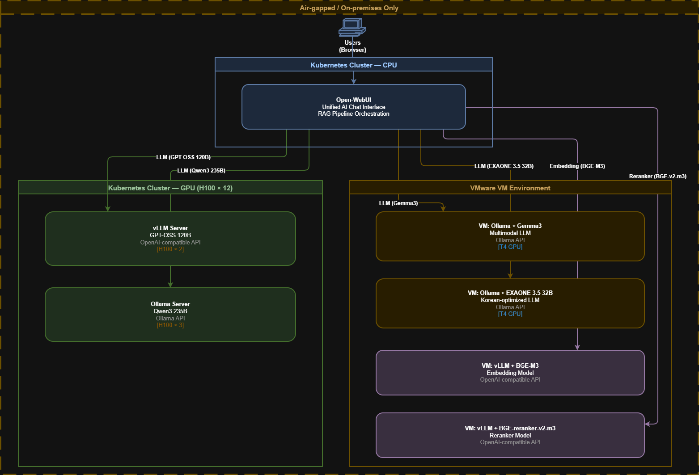

# AI Inference Platform (Air-gapped / On-prem)

Design documentation for an enterprise LLM inference platform running in an air-gapped, on-prem environment.
This case study focuses on multi-model serving, RAG-oriented endpoints, and GPU tiering (H100/T4) under strict network constraints.

## What to look at in this folder

- `arch.png` - architecture overview (rendered)
- `arch.drawio` - editable diagram source

## Architecture

- Diagram source (editable): [`arch.drawio`](arch.drawio)

### Topology (as designed)

- **Kubernetes Cluster (CPU)**
  - **Open-WebUI** as the unified chat UI and RAG pipeline orchestration layer
- **Kubernetes Cluster (GPU: H100 x 12)**
  - **vLLM server** for `GPT-OSS 120B` (OpenAI-compatible API)
  - **Ollama server** for `Qwen3 235B` (Ollama API)
- **VMware VM environment (T4 GPU)**
  - **Ollama + Gemma3** (multimodal LLM)
  - **Ollama + EXAONE 3.5 32B** (Korean-optimized LLM)
  - **vLLM + BGE-M3** (embedding model, OpenAI-compatible API)
  - **vLLM + BGE-reranker-v2-m3** (reranker model, OpenAI-compatible API)

> Note: Model names and hardware labels are included as shown in the diagram and may be adjusted in the final, sanitized write-up.

## Request flows

### 1) Chat / completion (no RAG)

1. User sends a prompt via **Open-WebUI**.
2. Open-WebUI routes the request to a selected LLM endpoint:
   - vLLM (OpenAI-compatible API), or
   - Ollama (Ollama API).

### 2) RAG (retrieve + rerank + generate)

1. User query enters **Open-WebUI**.
2. Open-WebUI calls the **embedding endpoint** (`BGE-M3`) to vectorize the query (and candidate passages).
3. (Optional) Open-WebUI calls the **reranker endpoint** (`BGE-reranker-v2-m3`) to improve top-k relevance.
4. Open-WebUI sends the augmented context to a selected **LLM endpoint** for final generation.

## Key design choices

- **Air-gapped first:** All services run on-prem with no external network dependency; artifacts (models/images) are mirrored internally.
- **Interface standardization:** Prefer OpenAI-compatible APIs where possible to simplify client integration; use Ollama where it provides operational convenience.
- **GPU tiering:** Use H100 cluster capacity for heavy LLM inference and keep T4 VMs for cost-efficient/specialized workloads (embeddings, reranking, smaller LLMs).
- **Separation of concerns:** Keep UI/orchestration on CPU nodes and isolate inference workloads on dedicated GPU backends.

## Security & operations (high level)

- Network segmentation between UI/orchestration and inference backends.
- Access control and auditability at the entry layer.
- Observability hooks for latency, throughput, and GPU utilization (metrics/logs can be integrated into standard monitoring stacks).

## Status

Work in progress. This folder will be expanded with deployment notes, endpoint conventions, and operational runbooks once sanitized.

