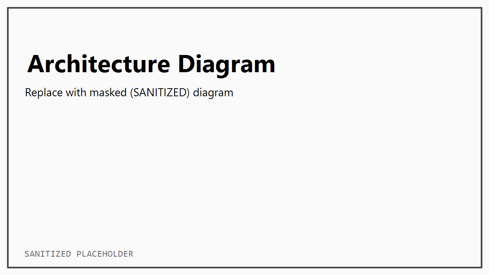

# Container Platform (Curated Case Study)

## TL;DR
- **What:** 컨테이너 기반 실행환경 표준화(개발/분석/서비스 배포 재현성 강화)
- **My role:** 설계/구현/운영(표준화 범위는 아래 문서에 명시)
- **Outcomes:** 배포 리드타임 단축, 재현성 향상, 장애 대응시간(MTTR) 단축, 보안/감사 대응력 강화

---

## Problem & Constraints
- 폐쇄망/망분리, 외부 패키지 제한, 내부 레지스트리 필요 등 제약이 존재
- 운영 인력/시간 제약으로 "문서화 가능한 반복 가능한 운영"이 중요
- (선택) GPU 노드/특수 런타임, 사내 인증/프록시/미들웨어 연동 필요

---

## Architecture


**Key components**
- Runtime: Docker / Compose (필요 시 Helm/Kubernetes 확장)
- Registry: (예: 내부 레지스트리 + 캐시 전략)
- Observability: Prometheus / Grafana (로그는 stdout 기반)
- Security: non-root, secrets 템플릿화, 이미지 스캐닝/정책(사내 기준에 맞게)

구성/흐름 상세: [`docs/architecture.md`](docs/architecture.md)

---

## Key Decisions (Why this design)
1. **Base image / build strategy**
   - multi-stage build로 런타임 이미지 최소화
   - 버전 핀/업데이트 전략(취약점 대응)
2. **Secrets & configuration**
   - `.env.template`만 포함, 실제 `.env`/토큰/인증서 미포함
3. **Health & readiness**
   - `HEALTHCHECK` + readiness 체크 스크립트
4. **Operational model**
   - 업데이트/롤백/백업/로그 확인 절차를 runbook으로 문서화

자세한 근거: [`docs/decisions.md`](docs/decisions.md)

---

## Repro (Minimal)
> This repo includes a sanitized minimal reproduction.

- Compose: [`repro/compose/`](repro/compose/)
- Dockerfile: [`repro/docker/`](repro/docker/)
- App code: [`repro/app/`](repro/app/)
- Smoke test: [`repro/scripts/smoke_test.sh`](repro/scripts/smoke_test.sh)

Example:
```bash
cp projects/container-platform/repro/compose/.env.template projects/container-platform/repro/compose/.env
docker compose -f projects/container-platform/repro/compose/compose.dev.yml --env-file projects/container-platform/repro/compose/.env up -d --build
bash projects/container-platform/repro/scripts/smoke_test.sh
```

---

## Ops Proof
- Runbook: [`docs/operations.md`](docs/operations.md)
- Troubleshooting: [`docs/troubleshooting.md`](docs/troubleshooting.md)
- Monitoring snapshot: `assets/grafana.png` (sanitized placeholder)

---

## Scope / Non-Goals
**In scope**
- 이미지/런타임 표준(빌드 전략, non-root, health)
- 최소 관측성(메트릭/대시보드 스냅샷, 로그 표준)
- 운영 절차(runbook) 문서화

**Out of scope**
- 서비스 비즈니스 로직 개발(별도)
- 특정 벤더/사내 전용 파일의 공개(샘플/템플릿만)

---

## Notes on confidentiality
- 모든 구성/스크린샷은 마스킹(SANITIZED) 처리
- secrets/tokens/certs are not included (templates only)

