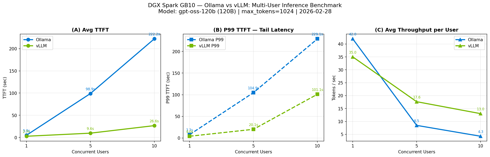

## Ollama vs vLLM — Benchmark Results

**Hardware:** NVIDIA DGX Spark (GB10, 128GB unified memory)  
**Model:** gpt-oss-120b (120B parameters)  
**Date:** 2026-02-28  
**Note:** req_id=0 (cold-start) excluded from aggregation.

| Engine | Concurrency | TTFT mean (s) | TTFT P50 (s) | TTFT P95 (s) | TTFT P99 (s) | TPS (tok/s) |
|--------|:-----------:|:-------------:|:------------:|:------------:|:------------:|:-----------:|
| Ollama | 1 | 4.96 | 4.96 | 7.48 | 7.70 | 42.0 |
| Ollama | 5 | 98.86 | 99.12 | 104.64 | 104.94 | 8.5 |
| Ollama | 10 | 222.16 | 221.31 | 228.85 | 229.14 | 4.3 |
| vLLM | 1 | 2.69 | 2.69 | 3.91 | 4.01 | 35.0 |
| vLLM | 5 | 9.62 | 8.57 | 19.13 | 20.07 | 17.6 |
| vLLM | 10 | 26.61 | 14.12 | 81.88 | 101.10 | 13.0 |

