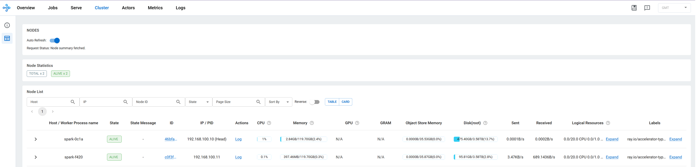
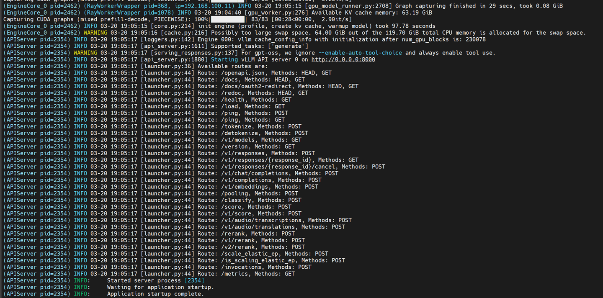

# Ray Multi-Node LLM Inference on DGX Spark

Validated multi-node LLM inference using Ray and vLLM across two DGX Spark systems, serving a 120B parameter model that exceeds single-node capacity under typical configurations.

---

## Environment

| Item             | Spec                                                   |
| ---------------- | ------------------------------------------------------ |
| Hardware         | NVIDIA DGX Spark × 2 (GB10, 128GB unified memory each) |
| Inference Engine | vLLM 0.10.1.1                                          |
| Orchestration    | Ray                                                    |
| Model            | GPT-OSS-120B (MXFP4)                                   |
| Network          | Local network between nodes                            |

---

## Motivation

A single DGX Spark (128GB unified memory) can load GPT-OSS-120B in MXFP4 quantization. However, to validate multi-node distribution feasibility — and to verify the Ray + vLLM stack before recommending production-scale deployment — this test was conducted across two nodes.

This setup directly maps to production environments where:

- Models exceed single-node memory capacity
- Horizontal scaling is required for throughput
- Air-gapped or private infrastructure precludes cloud-based solutions

---

## Architecture

```
┌─────────────────────────────────────┐
│           Ray Head Node             │
│    spark-0c1a (192.168.100.10)      │
│         DGX Spark #1 (GB10)         │
│         128GB Unified Memory        │
│                                     │
│  Ray Dashboard  :8265               │
│  vLLM Endpoint  :8000               │
└────────────────┬────────────────────┘
                 │ Ray Cluster (TCP :6379)
┌────────────────┴────────────────────┐
│           Ray Worker Node           │
│    spark-f420 (192.168.100.11)      │
│         DGX Spark #2 (GB10)         │
│         128GB Unified Memory        │
└─────────────────────────────────────┘
```

---

## Setup

See startup scripts in this directory:

- `run_ray-head.sh` — Head node (Ray + vLLM serve)
- `run_ray-worker.sh` — Worker node (Ray join)

### Key vLLM parameters for Ray distributed serving

```bash
vllm serve /model \
  --tensor-parallel-size 2 \
  --distributed-executor-backend ray \
  --host 0.0.0.0 \
  --port 8000
```

> **Port notes:**
>
> - `:6379` — Ray cluster communication (worker join address)
> - `:8265` — Ray Dashboard (use `--dashboard-port` to change)
> - `:8000` — vLLM inference endpoint
>
> `--network=host` is required for Ray inter-node communication.
> `--swap-space` must stay below total CPU memory (119.70 GiB on GB10); tested with `--swap-space 32`.

---

## Validation

### 1. Ray Cluster — 2 Nodes Active



`spark-0c1a` (Head, 192.168.100.10) and `spark-f420` (Worker, 192.168.100.11) confirmed ALIVE.

> **Note:** Ray Dashboard shows GPU as N/A on DGX Spark GB10 — unified memory architecture
> is not reported via standard CUDA VRAM metrics. Model loading and inference confirmed
> via vLLM logs and benchmark results below.

---

### 2. vLLM Startup — Application startup complete



Key log entries:

- `RayWorkerWrapper ip=192.168.100.11` — Worker node connected
- `Available KV cache memory: 63.19 GiB`
- `Application startup complete.`

---

### 3. Multi-User Benchmark

Concurrent request simulation via asyncio (see `benchmark/` directory).

| Concurrency | TTFT mean (s) | TTFT P99 (s) | TPS (tok/s) | System TPS |
| :---------: | :-----------: | :----------: | :---------: | :--------: |
|      1      |     2.41      |     2.93     |    35.2     |    34.8    |
|      5      |     12.42     |    22.13     |    16.2     |    80.9    |
|     10      |     21.43     |    67.03     |    14.8     |   122.6    |


---

## Key Findings

- GPT-OSS-120B successfully distributed across two DGX Spark nodes via Ray + vLLM tensor parallelism
- Since GPT-OSS-120B fits within a single node's 128GB unified memory, distributing across 2 nodes introduces inter-node communication overhead without memory benefit — system TPS is comparable to single-node
- **The primary value of multi-node Ray setup is enabling models that exceed single-node memory capacity**
- Validated as a feasible baseline for production-scale horizontal scaling in air-gapped environments

---

## Notes

- GB10 unified memory architecture differs from discrete GPU setups; `--gpu-memory-utilization` tuning may be required
- Ray Dashboard GPU metrics show N/A on GB10 unified memory — this is expected behavior
- Model weights must be accessible from all nodes (shared storage or pre-downloaded on each node)

---

## Files

| File                                                | Description                |
| --------------------------------------------------- | -------------------------- |
| `run_ray-head.sh`                                   | Head node startup script   |
| `run_ray-worker.sh`                                 | Worker node startup script |
| `benchmark/ray_multinode_inference_benchmark.ipynb` | Benchmark notebook         |
| `benchmark/RAY_BENCHMARK_RESULTS.md`                | Full benchmark results     |

---

## References

- [vLLM Distributed Inference Docs](https://docs.vllm.ai/en/latest/serving/distributed_serving.html)
- [Ray Documentation](https://docs.ray.io)
