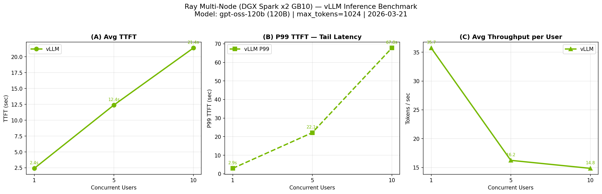

## Ray Multi-Node vLLM — Benchmark Results

**Setup:** Ray cluster across 2× DGX Spark GB10 (128GB unified memory each)  
**Model:** gpt-oss-120b (120B parameters, MXFP4)  
**Engine:** vLLM 0.10.1.1 | tensor_parallel_size=2 | distributed_executor_backend=ray  
**Date:** 2026-03-21  
**Note:** req_id=0 (cold-start warm-up) excluded from aggregation.

| Concurrency | TTFT mean (s) | TTFT P50 (s) | TTFT P95 (s) | TTFT P99 (s) | TPS (tok/s) |
|:-----------:|:-------------:|:------------:|:------------:|:------------:|:-----------:|
| 1 | 2.41 | 2.41 | 2.88 | 2.92 | 35.7 |
| 5 | 12.39 | 11.91 | 21.44 | 22.14 | 16.2 |
| 10 | 21.39 | 10.26 | 55.73 | 67.75 | 14.8 |

